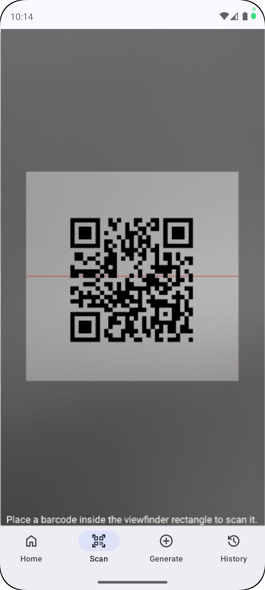
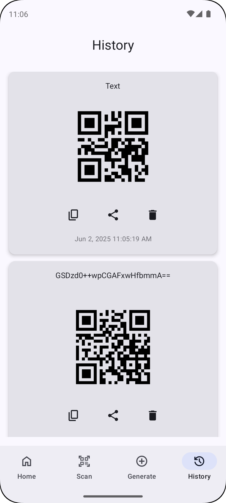

# 📱 Kodex – QR Code Scanner & Generator

Kodex is a lightweight and modern QR code app built with Jetpack Compose. You can create, scan, share, encrypt, and save QR codes with ease — all within a clean and intuitive interface.

Kodex is available on the Google Play Store.

<p align="left">
<a href="https://play.google.com/store/apps/details?id=com.mahmutalperenunal.kodex">
    
</a>  

---

## 🚀 Features

- ✅ **QR Code Generator**
- ✅ **QR Code Scanner via Camera**
- ✅ **AES Encrypted QR Code Support**
- ✅ **QR Code Sharing & Saving to Gallery**
- ✅ **Automatic History Log (Room Database)**
- ✅ **Modern Jetpack Compose UI**
- ✅ **Dark Theme Support**
- ✅ **Crash reporting** with [Firebase Crashlytics](https://firebase.google.com/docs/crashlytics)
- ✅ **User behavior analytics** with [Firebase Analytics](https://firebase.google.com/docs/analytics)

---

## 🛠 Built With

| Layer       | Technology                      |
|-------------|----------------------------------|
| UI          | Jetpack Compose, Material3       |
| Navigation  | Navigation Compose               |
| Database    | Room, ViewModel, LiveData        |
| QR Engine   | ZXing                            |
| Encryption  | AES (CBC/PKCS5Padding)           |
| File Sharing| FileProvider                     |
| Theming     | Dynamic colors, Dark Mode        |
| Language    | Kotlin (Compose-first approach)  |

---

## 📷 Screenshots

| Home | Scanner | QR Code Generator |
|------|---------|-------------------|
|  |  |  |
| History | Dark Home |
|  |  |

---

### 🔧 Firebase Setup

> Firebase is used for crash reporting and analytics (no sensitive user data is collected).

To enable Firebase features:
1. Create a Firebase project at [console.firebase.google.com](https://console.firebase.google.com)
2. Register your app using your package name.
3. Download `google-services.json` and place it in the `app/` directory.
4. Sync and run the project.

---

## ⚙️ Getting Started

1. Clone this repository:
   ```bash
   git clone https://github.com/mahmutaunal/kodex.git
